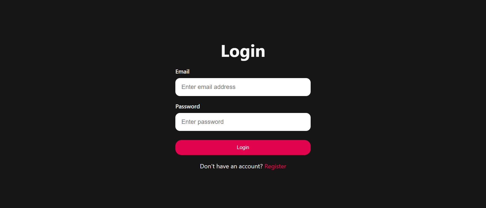
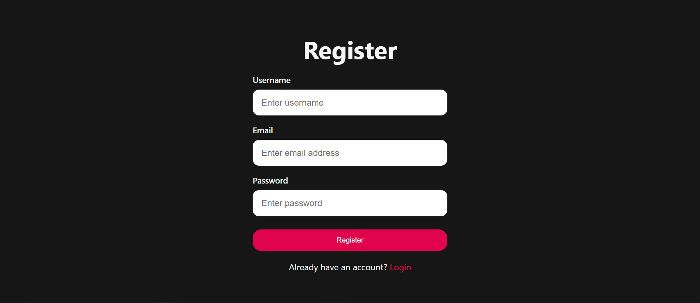
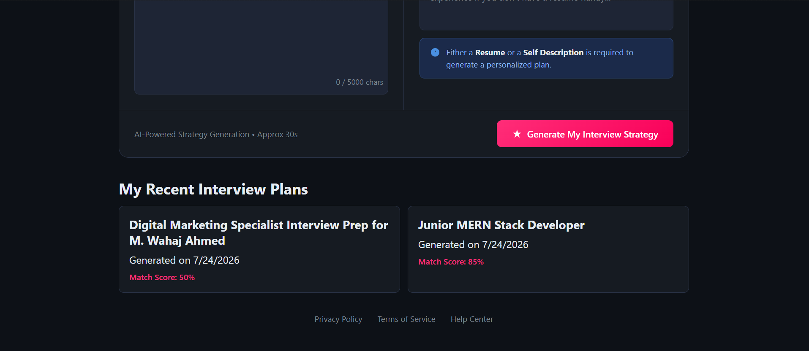
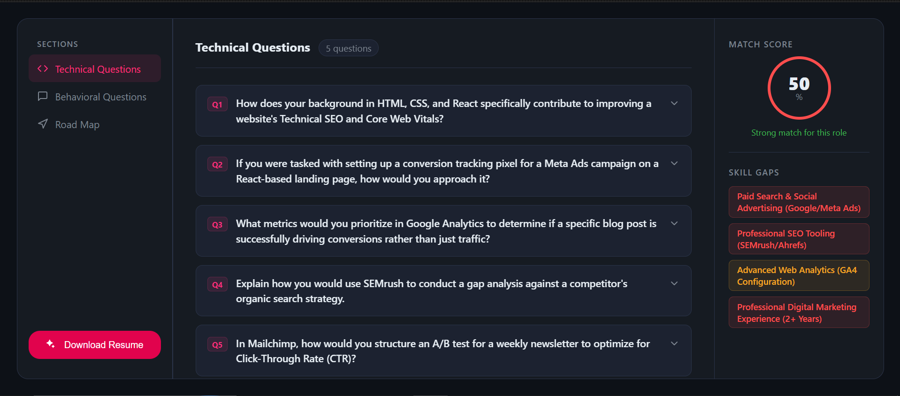
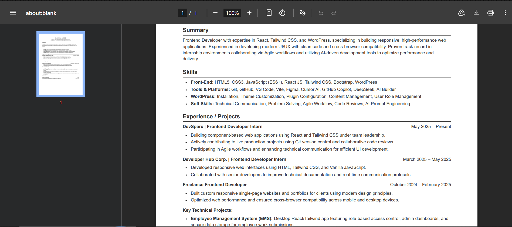

# 🚀 Interview Preparation Assistant

<p align="center">


</p>

<p align="center">

An AI-powered full-stack interview preparation platform that analyzes a candidate's resume, self-description, and target job description to generate personalized interview reports, skill gap analysis, technical questions, behavioral questions, and a structured preparation roadmap.

</p>

---

# 📑 Table of Contents

- [Project Overview](#-project-overview)
- [Why This Project?](#-why-this-project)
- [Key Features](#-key-features)
- [System Architecture](#-system-architecture)
- [Application Workflow](#-application-workflow)
- [Project Structure](#-project-structure)
- [Technologies Used](#-technologies-used)
- [API Documentation](#-api-documentation)
- [Getting Started](#-getting-started)
- [Environment Variables](#-environment-variables)
- [Application Screenshots](#-application-screenshots)
- [Project Documentation](#-project-documentation)
- [Challenges Faced](#-challenges-faced)
- [Testing](#-testing)
- [Deployment](#-deployment)
- [Future Improvements](#-future-improvements)
- [Learning Outcomes](#-learning-outcomes)
- [Contributing](#-contributing)
- [License](#-license)

---

# 📖 Project Overview

Interview Preparation Assistant is a full-stack AI application that helps software developers prepare for interviews more effectively.

Instead of simply generating random interview questions, the application analyzes the candidate's resume, self-description, and the target job description to create a personalized interview preparation report.

The generated report includes:

- Match score
- Resume analysis
- Technical interview questions
- Behavioral interview questions
- Skill gap analysis
- Seven-day preparation roadmap
- AI-generated professional resume
- Downloadable PDF resume

The project demonstrates practical implementation of modern MERN stack development while integrating Generative AI into a real-world workflow.

---
# 🌐 Live Demo

You can explore the application using the live demo below.

🔗 **Live Demo:** https://your-demo-url.com

---

## 🚀 Getting Started

### New User?

If you don't have an account yet:

1. Open the **Register** page.
2. Create a new account using your username, email, and password.
3. Log in with your newly created credentials.
4. Start generating personalized interview reports.

---

### Existing User?

Already have an account?

1. Go to the **Login** page.
2. Enter your registered email and password.
3. Access your dashboard and continue your interview preparation.

---

> **Note:** If the demo is hosted on a free-tier service (e.g., Render), the backend may take **30–60 seconds** to wake up after a period of inactivity.

---

# 💡 Why This Project?

Preparing for technical interviews often requires candidates to search through multiple resources, identify missing skills, and manually prepare resumes.

This project automates that process by combining:

- Resume Parsing
- Artificial Intelligence
- Authentication
- File Uploads
- PDF Generation
- MongoDB Data Storage
- React Frontend
- REST APIs

The goal is to provide an intelligent assistant that generates a complete interview preparation plan in just a few seconds.

---

# ⭐ Key Features

## 👤 Authentication

- User Registration
- User Login
- Secure JWT Authentication
- Cookie-Based Authentication
- Protected Routes
- Logout Functionality

---

## 🤖 AI Features

- Resume Analysis
- Job Description Analysis
- Self Description Analysis
- Match Score Generation
- Technical Question Generation
- Behavioral Question Generation
- Skill Gap Identification
- Seven-Day Preparation Plan
- AI Resume Generation

---

## 📄 Resume Features

- PDF Upload
- Resume Parsing
- Resume Optimization
- Resume Generation
- Resume PDF Download

---

## 📊 Report Features

- Personalized Interview Report
- Recent Reports History
- Report Storage
- Individual Report Page
- Resume Generation
- Match Score Display

---

# 🏗️ System Architecture

```text
                        +-------------------------+
                        |      React Frontend     |
                        |       (Vite + React)    |
                        +------------+------------+
                                     |
                                 Axios API
                                     |
                                     ▼
                        +-------------------------+
                        |     Express Backend     |
                        | Authentication & APIs   |
                        +------------+------------+
                                     |
                +--------------------+--------------------+
                |                                         |
                ▼                                         ▼
      +----------------------+               +----------------------+
      |   Google Gemini AI   |               |      MongoDB         |
      | AI Report Generator  |               | Users & Reports DB   |
      +----------------------+               +----------------------+
                |
                ▼
      +-----------------------------+
      | AI Interview Report         |
      | Resume Generation           |
      | PDF Generation              |
      +-----------------------------+
```

---

# 🔄 Application Workflow

```text
User Registration/Login
          │
          ▼
JWT Authentication
          │
          ▼
Upload Resume (PDF)
          │
          ▼
Enter Self Description
          │
          ▼
Paste Job Description
          │
          ▼
Backend Extracts Resume Text
          │
          ▼
Google Gemini AI Processing
          │
          ▼
Generate Interview Report
          │
          ▼
Validate AI Response (Zod)
          │
          ▼
Store Report in MongoDB
          │
          ▼
Display Report
          │
          ▼
Generate Resume PDF
```

---

# 📁 Project Structure

```text
Interview Preparation Assistant

├── Backend
│   ├── src
│   │   ├── config
│   │   ├── controllers
│   │   ├── middlewares
│   │   ├── routes
│   │   ├── services
│   │   └── models
│   │
│   ├── server.js
│   ├── package.json
│   └── .env
│
├── Frontend
│   ├── public
│   ├── src
│   │   ├── features
│   │   ├── style
│   │   ├── App.jsx
│   │   ├── main.jsx
│   │   └── app.routes.jsx
│   │
│   ├── package.json
│   └── vite.config.js
│
└── README.md
```

---

# 🛠 Technologies Used

## Backend

- Node.js
- Express.js
- MongoDB
- Mongoose
- JWT
- bcryptjs
- multer
- cors
- dotenv
- pdf-parse
- Puppeteer
- Google Gemini AI
- Zod
- zod-to-json-schema

---

## Frontend

- React
- Vite
- React Router DOM
- Axios
- Sass
- Lucide React
- Context API

---

## Development Tools

- VS Code
- Postman
- MongoDB Compass
- Git
- GitHub
- npm

---

## Architecture Pattern

The application follows a layered backend architecture to improve maintainability and scalability.

```text
Routes
   │
Controllers
   │
Services
   │
Database / AI
```

This separation of concerns makes the project easier to test, extend, and maintain as new features are added.


---

# 📡 API Documentation

The backend exposes RESTful APIs for authentication, interview report generation, and resume generation.

---

# 🔐 Authentication APIs

| Method | Endpoint | Description | Authentication |
|--------|----------|-------------|----------------|
| POST | `/api/auth/register` | Register a new user | ❌ |
| POST | `/api/auth/login` | Login an existing user | ❌ |
| GET | `/api/auth/logout` | Logout current user | ✅ |
| GET | `/api/auth/get-me` | Get logged-in user profile | ✅ |

---

## Register User

### Endpoint

```http
POST /api/auth/register
```

### Request Body

```json
{
    "username":"John Doe",
    "email":"john@example.com",
    "password":"12345678"
}
```

### Response

```json
{
    "success": true,
    "message": "User registered successfully."
}
```

---

## Login User

### Endpoint

```http
POST /api/auth/login
```

### Request Body

```json
{
    "email":"john@example.com",
    "password":"12345678"
}
```

### Response

```json
{
    "success": true,
    "token":"JWT_TOKEN"
}
```

---

# 🤖 Interview APIs

| Method | Endpoint | Description | Authentication |
|--------|----------|-------------|----------------|
| POST | `/api/interview` | Generate Interview Report | ✅ |
| GET | `/api/interview/report/:interviewId` | Get Single Interview Report | ✅ |
| GET | `/api/interview/reports` | Get All Reports | ✅ |
| POST | `/api/interview/resume/pdf/:interviewReportId` | Generate Resume PDF | ✅ |

---

## Generate Interview Report

### Endpoint

```http
POST /api/interview
```

### Form Data

| Key | Type |
|------|------|
| resume | PDF File |
| selfDescription | Text |
| jobDescription | Text |

---

### Example Request

```text
resume: resume.pdf

selfDescription:
"I am a MERN Stack developer passionate about building scalable web applications."

jobDescription:
"Looking for a React developer with Node.js experience."
```

---

### Example Response

```json
{
    "matchScore": 86,
    "technicalQuestions": [
        {
            "question":"Explain React Virtual DOM.",
            "answer":"..."
        }
    ],
    "behaviorQuestions":[
        {
            "question":"Tell me about yourself."
        }
    ],
    "skillGaps":[
        "TypeScript",
        "Testing"
    ],
    "preparationPlan":[
        "...7 Day Roadmap..."
    ]
}
```

---

## Generate Resume PDF

### Endpoint

```http
POST /api/interview/resume/pdf/:interviewReportId
```

This endpoint generates a professionally formatted PDF resume based on the AI-generated resume content.

---

# 🚀 Getting Started

## Prerequisites

Before running the project, ensure the following software is installed.

- Node.js (v22 or later)
- npm
- MongoDB Atlas or Local MongoDB
- Git
- Google Gemini API Key

---

## Clone Repository

```bash
git clone https://github.com/yourusername/interview-preparation-assistant.git
```

---

## Navigate to Project

```bash
cd interview-preparation-assistant
```

---

# ⚙ Backend Setup

Move into the backend directory.

```bash
cd Backend
```

Install dependencies.

```bash
npm install
```

Start development server.

```bash
npm run dev
```

Backend runs on

```
http://localhost:3000
```

---

# 💻 Frontend Setup

Move into frontend folder.

```bash
cd Frontend
```

Install dependencies.

```bash
npm install
```

Run development server.

```bash
npm run dev
```

Frontend runs on

```
http://localhost:5173
```

---

# 🔑 Environment Variables

Create a `.env` file inside the **Backend** directory.

```env
PORT=3000

MONGO_URI=your_mongodb_connection_string

JWT_SECRET=your_secret_key

GOOGLE_GEN_API_KEY=your_google_api_key
```

---

# 📦 Backend Dependencies

```bash
npm install express mongoose cors dotenv bcryptjs jsonwebtoken cookie-parser multer pdf-parse puppeteer @google/genai zod zod-to-json-schema
```

---

# 📦 Frontend Dependencies

```bash
npm install react react-router-dom axios sass lucide-react
```

---

# ▶ Running the Project

Open two terminals.

### Terminal 1

```bash
cd Backend
npm run dev
```

### Terminal 2

```bash
cd Frontend
npm run dev
```

Open your browser.

```
http://localhost:5173
```

---

# 📷 Application Screenshots

> Replace the following images with actual screenshots after deployment.

## Login Page





---

## Register Page





---

## Home Dashboard


---

## Create Interview Report



## Interview Report





---

## Resume PDF





---

# 📂 Project Documentation

The following section provides a detailed explanation of every important file and directory used throughout the project.

Each file has been documented to make it easier for developers to understand the overall architecture, responsibilities, and implementation details.

This documentation is intended for:

- Developers exploring the project.
- Recruiters reviewing project quality.
- Interviewers evaluating architecture decisions.
- Contributors interested in extending the application.

---

# 📂 Project Documentation

This section provides an overview of the major files and folders in the project. Understanding the responsibility of each file makes it easier to navigate, maintain, and extend the application.

---

# 📁 Backend Documentation

## `.env`

Stores environment variables used by the backend.

Variables include:

- MongoDB Connection URI
- JWT Secret Key
- Google Gemini API Key
- Server Port

> This file should never be committed to source control.

---

## `package.json`

Contains backend project information including:

- Project metadata
- Installed dependencies
- Development dependencies
- npm scripts

Main scripts:

```bash
npm run dev
npm start
```

---

## `server.js`

The entry point of the backend application.

Responsibilities:

- Loads environment variables
- Connects MongoDB
- Starts Express Server
- Handles server initialization

---

## `src/app.js`

Configures the Express application.

Includes:

- Middleware Registration
- Cookie Parser
- CORS Configuration
- Route Registration
- JSON Parsing

---

# 📂 Config Folder

## `database.js`

Responsible for establishing a connection with MongoDB using Mongoose.

Features:

- Database Connection
- Error Handling
- Connection Status Logging

---

# 📂 Models

## `user.model.js`

Defines the User schema.

Stores:
- Username
- Email
- Password
- Created Date

---

## `interviewReport.model.js`

Stores every generated interview report.

Contains:

- Job Description
- Resume Content
- Self Description
- Match Score
- Technical Questions
- Behavioral Questions
- Skill Gap Analysis
- Preparation Plan
- Resume HTML
- User Reference

---

## `blacklist.model.js`

Stores invalid JWT tokens after logout.

Used for:

- Secure Logout
- Token Invalidation
- Session Management

---

# 📂 Controllers

## `auth.controller.js`

Handles user authentication.

Responsibilities:

- Register User
- Login User
- Logout User
- Get Current User

---

## `interview.controller.js`

Handles all interview-related operations.

Responsibilities:

- Generate Interview Report
- Upload Resume
- Parse PDF
- Save Report
- Fetch Reports
- Generate Resume PDF

---

# 📂 Middleware

## `auth.middleware.js`

Protects private routes.

Functions:

- Verify JWT
- Authenticate User
- Reject Invalid Tokens

---

## `file.middleware.js`

Handles file uploads.

Uses:

- Multer
- Memory Storage
- File Size Validation

---

# 📂 Routes

## `auth.routes.js`

Defines authentication endpoints.

Routes include:

- Register
- Login
- Logout
- Get Current User

---

## `interview.routes.js`

Defines interview APIs.

Routes include:

- Generate Report
- Fetch Reports
- Fetch Single Report
- Generate Resume PDF

---

# 📂 Services

## `ai.service.js`

The core AI engine of the application.

Responsibilities:

- Prompt Engineering
- Google Gemini Integration
- AI Report Generation
- Resume Generation
- Response Validation
- HTML Resume Creation
- PDF Generation

---

## `temp.js`

Contains sample data used during development for testing prompts and AI responses.

---

# 🎨 Frontend Documentation

## `package.json`

Contains frontend dependencies and npm scripts.

Main scripts:

```bash
npm run dev
npm run build
```

---

## `main.jsx`

Frontend entry point.

Responsibilities:

- Render React Application
- Import Global Styles
- Initialize Root Component

---

## `App.jsx`

Main application component.

Responsibilities:

- Load Context Providers
- Render Application Routes
- Manage Global Layout

---

## `app.routes.jsx`

Defines client-side routing using React Router.

Routes include:

- Login
- Register
- Home
- Interview Report

---

# 📂 Authentication Module

## `auth.context.jsx`

Manages global authentication state.

Responsibilities:

- Store User
- Login
- Register
- Logout
- Authentication Status

---

## `useAuth.js`

Custom React Hook for authentication.

Provides:

- Login Function
- Register Function
- Logout Function
- Current User

---

## `auth.api.js`

Communicates with backend authentication APIs using Axios.

---

## `Protected.jsx`

Protects authenticated pages.

Features:

- Route Protection
- Redirect Unauthenticated Users
- Loading State

---

# 📂 Interview Module

## `interview.context.jsx`

Stores interview-related state.

Responsibilities:

- Current Report
- Reports List
- Loading State
- API Calls

---

## `useInterview.js`

Custom hook for interview operations.

Provides:

- Create Report
- Get Reports
- Get Single Report
- Download Resume

---

## `interview.api.js`

Handles interview API communication with Axios.

---

## `Home.jsx`

Main dashboard page.

Features:

- Upload Resume
- Enter Job Description
- Enter Self Description
- Generate Interview Report
- View Recent Reports

---

## `Interview.jsx`

Displays the generated interview report.

Sections include:

- Match Score
- Technical Questions
- Behavioral Questions
- Skill Gaps
- Preparation Plan
- Resume Generator

---

# 🎨 Styling

The project uses **SCSS** for styling.

Styles are organized into:

- Global Styles
- Authentication Styles
- Home Page Styles
- Interview Page Styles
- Skeleton Loading UI
- Button Components

---

# 📂 Public Folder

Stores static assets such as:

- Application Icon
- Images
- Future Static Files

---

# 📌 Design Principles

This project follows several software engineering principles:

- Separation of Concerns
- Component-Based Architecture
- Reusable React Components
- RESTful API Design
- Layered Backend Architecture
- Context-Based State Management
- - Skeleton Loading UI
- Scalable Folder Structure
- Clean Code Practices

---

# 📈 Overall Project Flow

```text
Frontend
   │
Axios Requests
   │
Express Routes
   │
Controllers
   │
Services
   │
Google Gemini AI
   │
MongoDB Database
   │
Response
   │
React UI
```


---

# ⚠ Challenges Faced

Developing this project involved solving several real-world engineering challenges across both the frontend and backend.

## Authentication

- Implemented secure JWT authentication using HTTP-only cookies.
- Protected private routes on both the client and server.
- Managed user sessions and logout functionality.

---

## Resume Parsing

- Accepted PDF resume uploads using Multer.
- Extracted readable text from uploaded resumes using `pdf-parse`.
- Validated uploaded files and handled parsing errors gracefully.

---

## AI Integration

- Integrated Google Gemini AI for intelligent interview report generation.
- Designed structured prompts for consistent AI responses.
- Handled AI response validation using Zod schemas.
- Managed API failures, malformed responses, and retry logic.

---

## Resume Generation

- Generated professional HTML resumes.
- Converted generated HTML into downloadable PDF documents using Puppeteer.

---

## Frontend Challenges

- Managing authentication state with React Context.
- Handling protected routes.
- Managing asynchronous API requests.
- Building reusable components.
- Organizing a scalable folder structure.

---

## Backend Challenges

- Designing RESTful APIs.
- Database schema design.
- Error handling.
- Middleware organization.
- Cookie authentication.
- AI service abstraction.

---

# 🧪 Testing

The application has been manually tested across multiple workflows.

## Authentication

- User Registration
- User Login
- Logout
- Protected Routes
- Invalid Credentials
- Authentication Persistence

---

## Interview Module

- Resume Upload
- AI Report Generation
- Report Storage
- Report Retrieval
- Match Score Generation
- Skill Gap Analysis
- Resume PDF Generation

---

## Backend

- API Validation
- MongoDB CRUD Operations
- JWT Verification
- Middleware Testing
- Error Handling
- File Upload Validation

---

## Frontend

- Form Validation
- API Integration
- Navigation
- Loading States
- Error Messages
- Responsive Layout

---

## Tools Used

- Postman
- Browser Developer Tools
- MongoDB Compass
- npm
- Git

---

### Troubleshooting

**MongoDB Connection Fails**
- Verify MongoDB Atlas IP whitelist
- Check connection string format
- Ensure VPN is not blocking connections

**Google Gemini API Errors**
- Verify API key is valid
- Check quota limits
- Review error logs for rate limiting

**Resume PDF Generation Fails**
- Ensure Puppeteer dependencies installed
- Check system memory
- Verify HTML resume format

---

# ☁ Deployment

The project is designed for deployment on modern cloud platforms.

## Frontend

- Vercel
- Netlify

---

## Backend

- Railway
- Render

---

## Database

- MongoDB Atlas

---

## Environment

```
Frontend → React + Vite

Backend → Express.js

Database → MongoDB Atlas

AI → Google Gemini

Authentication → JWT + Cookies
```

---

# 📈 Performance Considerations

Several practices were followed to improve scalability and maintainability.

- Modular folder structure.
- Layered architecture.
- Reusable React components.
- Context API for global state.
- RESTful API design.
- Middleware separation.
- Database normalization.
- AI response validation.
- Error handling.
- Clean code practices.

---

# 🚀 Future Improvements

Future versions of the project may include:

## AI Features

- AI Mock Interviews
- Voice Interview Practice
- AI Feedback on Spoken Answers
- Company-Specific Interview Preparation
- AI Career Suggestions

---

## Resume Features

- Resume Score Analysis
- Resume Templates
- Cover Letter Generator
- ATS Compatibility Checker

---

## User Features

- Email Verification
- Forgot Password
- Password Reset
- User Profile
- Profile Picture Upload

---

## Dashboard

- Analytics Dashboard
- Interview History
- Progress Tracking
- Statistics
- Recent Activity

---

## Technical Improvements

- Docker Support
- CI/CD Pipeline
- Unit Testing
- Integration Testing
- Redis Caching
- API Documentation with Swagger
- Rate Limiting
- Request Logging
- Microservice Architecture

---

# 📚 Learning Outcomes

This project significantly improved my understanding of modern full-stack web development.

## Backend

- Express.js
- MongoDB
- Mongoose
- JWT Authentication
- Cookie Authentication
- REST API Development
- Middleware Design
- File Upload Handling
- PDF Generation

---

## Frontend

- React
- React Router
- Context API
- Axios
- SCSS
- Component Architecture
- Protected Routes
- State Management

---

## Artificial Intelligence

- Google Gemini AI
- Prompt Engineering
- Structured AI Responses
- Zod Validation
- Resume Generation
- Interview Report Generation

---

## Software Engineering

- Project Architecture
- Folder Organization
- Error Handling
- Clean Code
- Git Workflow
- Documentation
- Scalability
- Maintainability

---

# 📖 Project Highlights

✔ Full Stack MERN Application

✔ AI-Powered Interview Preparation

✔ Google Gemini Integration

✔ Resume Parsing

✔ Resume PDF Generation

✔ JWT Authentication

✔ Protected Routes

✔ Cookie-Based Authentication

✔ MongoDB Database

✔ Modern React Architecture

✔ RESTful APIs

✔ Scalable Project Structure

✔ Responsive User Interface

---

# 🤝 Contributing

Contributions are welcome.

If you'd like to improve the project:

1. Fork the repository.

2. Create a new feature branch.

```bash
git checkout -b feature/new-feature
```

3. Commit your changes.

```bash
git commit -m "Add new feature"
```

4. Push to GitHub.

```bash
git push origin feature/new-feature
```

5. Open a Pull Request.

Every contribution that improves the project, fixes bugs, enhances documentation, or adds features is appreciated.

---

# 📄 License

This project is licensed under the **MIT License**.

You are free to use, modify, and distribute this project for educational and personal purposes.

---

# 👨‍💻 Author

**Muhammed Wahaj Ahmed**

MERN Stack Developer

If you found this project helpful, consider giving it a ⭐ on GitHub.

---

# ⭐ Support

If you like this project:

⭐ Star the repository

🍴 Fork the repository

📢 Share it with others

💡 Suggest improvements

Thank you for checking out this project!

---

<p align="center">

Made with ❤️ using **React, Node.js, Express, MongoDB, and Google Gemini AI**

</p>