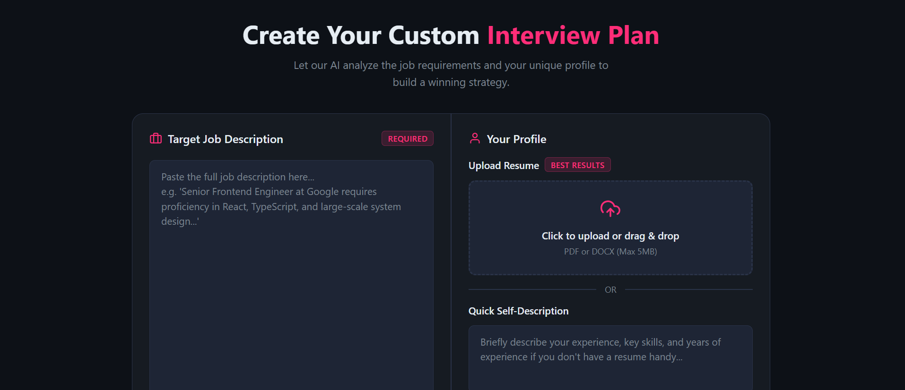

# 🚀 Interview AI


A full-stack AI-powered interview preparation platform where users can
register, provide a target job description and personal profile, upload
their resume, and generate a personalized interview report using Google
Gemini.

The application analyzes the provided information and creates a
match score, technical interview questions, behavioral interview
questions, skill gaps, and a seven-day preparation roadmap. Users can
review saved reports, delete old reports, and generate an optimized
resume PDF from an existing interview report.

------------------------------------------------------------------------

# 📑 Table of Contents

-   [Project Overview](#-project-overview)
-   [Why This Project?](#-why-this-project)
-   [Key Features](#-key-features)
-   [System Architecture](#-system-architecture)
-   [Application Workflow](#-application-workflow)
-   [Project Structure](#-project-structure)
-   [Technologies Used](#-technologies-used)
-   [API Documentation](#-api-documentation)
-   [Getting Started](#-getting-started)
-   [Environment Variables](#-environment-variables)
-   [Application Screenshots](#-application-screenshots)
-   [Project Documentation](#-project-documentation)
-   [Challenges Faced](#-challenges-faced)
-   [Testing](#-testing)
-   [Deployment](#-deployment)
-   [Performance Considerations](#-performance-considerations)
-   [Future Improvements](#-future-improvements)
-   [Learning Outcomes](#-learning-outcomes)
-   [Contributing](#-contributing)
-   [License](#-license)

------------------------------------------------------------------------

# 📖 Project Overview

Interview AI is a full-stack React and Node.js application designed to
help candidates prepare for job interviews using generative AI.

The platform has one main account type:

-   **Users** who create accounts, submit job and profile information,
    generate interview reports, review preparation recommendations,
    and download AI-generated resume PDFs.

The application combines:

-   User authentication
-   Resume upload
-   Job description analysis
-   Self-description input
-   AI-generated interview preparation
-   Technical questions
-   Behavioral questions
-   Skill-gap analysis
-   Match scoring
-   Seven-day preparation roadmap
-   Saved interview reports
-   Report deletion
-   AI-assisted resume PDF generation

The project demonstrates practical full-stack development using React,
Vite, Node.js, Express, MongoDB, JWT authentication, Google Gemini,
Multer, PDF parsing, Puppeteer, responsive SCSS, REST APIs, and Vercel
deployment configuration.

------------------------------------------------------------------------

# 🌐 Live Demo

The frontend is configured to communicate with the deployed backend
below.

🔗 **Backend API:** https://interview-copilot-nine-lemon.vercel.app

The project also contains Vercel configuration files for deploying both
the frontend and backend.

------------------------------------------------------------------------

## 🚀 Getting Started

### New User?

If you don't have an account yet:

1.  Open the **Register** page.
2.  Enter your username, email, and password.
3.  Submit the registration form.
4.  The application creates the account and authenticates the user using
    a JWT cookie.
5.  Start creating personalized interview plans.

------------------------------------------------------------------------

### Existing User?

Already have an account?

1.  Open the **Login** page.
2.  Enter your registered email and password.
3.  Submit the login form.
4.  The application authenticates the user using a JWT cookie.
5.  Continue to the interview planning dashboard.

------------------------------------------------------------------------

> **Note:** The deployed application is configured as a demo. Because
> the project uses free-tier hosting, the backend may sleep after
> inactivity and demo data may be deleted or reset.

------------------------------------------------------------------------

# 💡 Why This Project?

Preparing for an interview often requires candidates to compare their
experience against a specific job description, identify missing skills,
practice relevant questions, and organize their preparation.

Interview AI brings these tasks together into one workflow.

The platform combines:

-   Job description analysis
-   Resume parsing
-   Personal profile analysis
-   AI-generated interview questions
-   Match scoring
-   Skill-gap identification
-   Seven-day preparation planning
-   Interview report history
-   AI-generated resume PDF output

The goal is to give a candidate a structured preparation plan based on
the role they are targeting and the information they provide.

------------------------------------------------------------------------

# ⭐ Key Features

## 👤 Authentication

-   User Registration
-   User Login
-   User Logout
-   Current-user session retrieval
-   JWT-based authentication
-   HTTP-only authentication cookie
-   Password hashing with bcryptjs
-   Authentication middleware for protected APIs
-   Token blacklist support for logged-out sessions
-   Protected frontend routes
-   Loading states during authentication
-   Login and registration error states
-   Show/hide password controls

------------------------------------------------------------------------

## 🎯 Interview Planning

-   Target job description input
-   Job description character counter
-   Resume upload
-   Self-description input
-   AI-powered interview plan generation
-   Personalized match score
-   Technical interview questions
-   Behavioral interview questions
-   Skill-gap analysis
-   Seven-day preparation roadmap
-   Practical interview preparation recommendations

------------------------------------------------------------------------

## 📄 Resume Processing

-   Resume upload through the frontend
-   Multipart form-data submission
-   Multer memory storage
-   PDF text extraction using `pdf-parse`
-   Resume content passed to the AI generation service
-   Existing interview report data reused for resume generation
-   AI-generated resume PDF
-   PDF response returned directly from the backend
-   Downloadable generated resume

> The current frontend file selector accepts `.pdf` and `.docx`, while
> the backend interview controller currently extracts uploaded resume
> content using `pdf-parse`. The documented backend implementation
> therefore currently supports PDF parsing.

------------------------------------------------------------------------

## 🤖 AI Features

-   Google Gemini integration using `@google/genai`
-   Structured AI response schema using Zod
-   JSON-schema conversion with `zod-to-json-schema`
-   Match score from 0 to 100
-   Up to 5 technical questions
-   Up to 5 behavioral questions
-   Skill gaps with low, medium, and high severity
-   Exactly seven preparation-plan days
-   AI-generated interview preparation advice
-   AI-generated resume content
-   Retry mechanism for failed AI requests
-   JSON response validation

------------------------------------------------------------------------

## 📊 Interview Reports

-   Create interview reports
-   Store reports in MongoDB
-   View all previous reports
-   View an individual report
-   Display report title
-   Display match score
-   Delete interview reports
-   Recent Reports section on the dashboard
-   Navigate from a recent report directly to its detailed view
-   Loading/skeleton state while a report is being fetched

------------------------------------------------------------------------

## 🧠 Interview Report Experience

-   Technical Questions section
-   Behavioral Questions section
-   Preparation Road Map section
-   Expandable question cards
-   Interview question intention
-   Model answer guidance
-   Seven-day preparation timeline
-   Match score visualization
-   Skill-gap severity indicators
-   Responsive three-column desktop layout
-   Responsive navigation on smaller screens
-   Back to Home navigation
-   Download Resume action

------------------------------------------------------------------------

## 🎨 User Experience

-   Responsive UI
-   Dark interface
-   SCSS styling
-   Shared design variables
-   Reusable authentication styles
-   Reusable button styles
-   Loading screens
-   Form error states
-   Skeleton report loading UI
-   Demo notice
-   Recent report cards
-   Responsive interview report layout
-   Mobile-friendly navigation
-   Show/hide password interaction

------------------------------------------------------------------------

# 🏗️ System Architecture

``` text
                         +--------------------------+
                         |      React Frontend      |
                         |       Vite + React       |
                         +------------+-------------+
                                      |
                               Axios + Cookies
                                      |
                                      ▼
                         +--------------------------+
                         |      Express Backend     |
                         |      REST API + Auth     |
                         +------------+-------------+
                                      |
             +------------------------+------------------------+
             |                        |                        |
             ▼                        ▼                        ▼
      +-------------+          +-------------+          +-------------+
      |   MongoDB   |          | Google      |          | Puppeteer   |
      | Users &     |          | Gemini AI   |          | PDF         |
      | Reports     |          | Generation  |          | Generation  |
      +-------------+          +-------------+          +-------------+
             |
             ▼
      +-------------+
      | JWT Cookies |
      | + Blacklist |
      +-------------+
```

------------------------------------------------------------------------

# 🔄 Application Workflow

``` text
User
  │
  ▼
Register / Login
  │
  ▼
JWT Authentication Cookie
  │
  ▼
Interview Dashboard
  │
  ├───────────────┬─────────────────┐
  ▼               ▼                 ▼
Job Description  Resume          Self Description
  │               │                 │
  └───────────────┴─────────────────┘
                  │
                  ▼
          Generate Interview Plan
                  │
                  ▼
             Google Gemini
                  │
                  ▼
          Structured AI Report
                  │
        ┌─────────┼─────────┬──────────────┐
        ▼         ▼         ▼              ▼
    Match Score  Technical  Behavioral   Skill Gaps
        │         Questions  Questions       │
        └─────────┴──────────┴──────────────┘
                         │
                         ▼
                 7-Day Roadmap
                         │
                         ▼
                 Save to MongoDB
                         │
             ┌───────────┴───────────┐
             ▼                       ▼
       View Report              Recent Reports
             │                       │
             ▼                       ▼
      Download Resume PDF       Delete Report
```

------------------------------------------------------------------------

# 📁 Project Structure

``` text
interview-ai

├── Backend
│   ├── src
│   │   ├── config
│   │   │   └── database.js
│   │   ├── controllers
│   │   │   ├── auth.controller.js
│   │   │   └── interview.controller.js
│   │   ├── middlewares
│   │   │   ├── auth.middleware.js
│   │   │   └── file.middleware.js
│   │   ├── models
│   │   │   ├── blacklist.model.js
│   │   │   ├── interviewReport.model.js
│   │   │   └── user.model.js
│   │   ├── routes
│   │   │   ├── auth.routes.js
│   │   │   └── interview.routes.js
│   │   ├── services
│   │   │   └── ai.service.js
│   │   └── app.js
│   │
│   ├── server.js
│   ├── package.json
│   ├── vercel.json
│   └── .env
│
├── Frontend
│   ├── public
│   │   └── icon.png
│   ├── screenshots
│   │   ├── Home.png
│   │   ├── InterviewReport.png
│   │   ├── Register.png
│   │   ├── Resumepdf.png
│   │   ├── creatInterview.png
│   │   └── login.png
│   ├── src
│   │   ├── features
│   │   │   ├── auth
│   │   │   │   ├── components
│   │   │   │   ├── hooks
│   │   │   │   ├── pages
│   │   │   │   ├── services
│   │   │   │   ├── auth.context.jsx
│   │   │   │   └── auth.form.scss
│   │   │   └── interview
│   │   │       ├── hooks
│   │   │       ├── pages
│   │   │       ├── services
│   │   │       ├── style
│   │   │       └── interview.context.jsx
│   │   ├── style
│   │   │   └── button.scss
│   │   ├── App.jsx
│   │   ├── app.routes.jsx
│   │   ├── main.jsx
│   │   └── style.scss
│   │
│   ├── index.html
│   ├── package.json
│   ├── vite.config.js
│   ├── vercel.json
│   └── eslint.config.js
│
└── README.md
```

> The repository also contains package-lock files and other local
> development/configuration files that are not expanded in the main
> architecture diagram.

------------------------------------------------------------------------

# 🛠 Technologies Used

## Backend

-   Node.js
-   Express 5
-   MongoDB
-   Mongoose
-   JSON Web Token
-   bcryptjs
-   cookie-parser
-   cors
-   dotenv
-   multer
-   pdf-parse
-   Google GenAI SDK
-   Zod
-   zod-to-json-schema
-   Puppeteer
-   Puppeteer Core
-   Chromium for serverless deployment

------------------------------------------------------------------------

## Frontend

-   React 19
-   React DOM
-   Vite
-   React Router
-   Axios
-   Sass / SCSS
-   CSS
-   Responsive design

------------------------------------------------------------------------

## Development Tools

-   VS Code
-   Postman
-   MongoDB / MongoDB Atlas
-   Git
-   GitHub
-   npm
-   Vercel
-   Browser Developer Tools

------------------------------------------------------------------------

## Architecture Pattern

The application follows a separated frontend/backend architecture.

``` text
Frontend
   │
   │ Axios
   ▼
Express Routes
   │
   ├── Authentication Routes
   └── Interview Routes
   │
   ▼
Controllers
   │
   ├── Authentication
   └── Interview Reports
   │
   ▼
Services / Models
   │
   ├── Google Gemini
   ├── MongoDB
   ├── PDF Parser
   └── Puppeteer
```

This separation keeps authentication, interview-report generation,
database persistence, AI integration, file handling, and UI
responsibilities organized independently.

------------------------------------------------------------------------

# 📡 API Documentation

The backend exposes RESTful APIs for authentication, interview report
generation, report retrieval, report deletion, and AI-generated resume
PDF creation.

The deployed frontend currently uses:

``` text
https://interview-copilot-nine-lemon.vercel.app
```

------------------------------------------------------------------------

# 🔐 Authentication APIs

  --------------------------------------------------------------------------------
  Method       Endpoint                    Description                 Authentication
  ------------ --------------------------- --------------------------- ----------------
  POST         `/api/auth/register`        Register a new user         ❌

  POST         `/api/auth/login`           Login an existing user      ❌

  GET          `/api/auth/logout`          Logout current user         ❌

  GET          `/api/auth/get-me`          Get current user details    User
  --------------------------------------------------------------------------------

------------------------------------------------------------------------

## Register User

### Endpoint

``` http
POST /api/auth/register
```

### Request Body

``` json
{
    "username": "JohnDoe",
    "email": "john@example.com",
    "password": "12345678"
}
```

The password is hashed using bcryptjs before being stored.

------------------------------------------------------------------------

## Login User

### Endpoint

``` http
POST /api/auth/login
```

### Request Body

``` json
{
    "email": "john@example.com",
    "password": "12345678"
}
```

A JWT is created and stored in an HTTP-only cookie.

------------------------------------------------------------------------

## Logout User

### Endpoint

``` http
GET /api/auth/logout
```

The current token is added to the token blacklist and the authentication
cookie is cleared.

------------------------------------------------------------------------

## Get Current User

### Endpoint

``` http
GET /api/auth/get-me
```

### Authentication

``` text
Required
```

Returns the currently authenticated user's:

-   ID
-   Username
-   Email

------------------------------------------------------------------------

# 🤖 Interview APIs

  ------------------------------------------------------------------------------------------
  Method       Endpoint                              Description              Authentication
  ------------ ------------------------------------- ------------------------ ----------------
  POST         `/api/interview/`                     Generate interview       User
                                                      report

  GET          `/api/interview/`                     Get all reports          User

  GET          `/api/interview/report/:interviewId`  Get one interview       User
                                                      report

  DELETE       `/api/interview/report/:interviewId`  Delete interview        User
                                                      report

  POST         `/api/interview/resume/pdf/:id`       Generate resume PDF     User
  ------------------------------------------------------------------------------------------

------------------------------------------------------------------------

## Generate Interview Report

### Endpoint

``` http
POST /api/interview/
```

### Content Type

``` text
multipart/form-data
```

### Form Data

  Key               Type
  ----------------- ----------------
  `jobDescription`  Text
  `selfDescription` Text
  `resume`          PDF File


The backend:

1. Authenticates the user.
2. Receives the uploaded resume through Multer.
3. Extracts resume text using `pdf-parse`.
4. Sends the resume, self-description, and job description to Google
   Gemini.
5. Validates the expected AI structure using Zod.
6. Stores the generated report in MongoDB.
7. Returns the created interview report.

------------------------------------------------------------------------

## Get All Interview Reports

### Endpoint

``` http
GET /api/interview/
```

Returns the authenticated user's interview reports ordered by newest
first.

The list response intentionally excludes large report fields such as
the original resume, self-description, job description, technical
questions, behavioral questions, skill gaps, and preparation plan.

------------------------------------------------------------------------

## Get Interview Report

### Endpoint

``` http
GET /api/interview/report/:interviewId
```

Returns one interview report belonging to the authenticated user.

------------------------------------------------------------------------

## Delete Interview Report

### Endpoint

``` http
DELETE /api/interview/report/:interviewId
```

Deletes an interview report belonging to the authenticated user.

------------------------------------------------------------------------

## Generate Resume PDF

### Endpoint

``` http
POST /api/interview/resume/pdf/:interviewReportId
```

The endpoint uses the stored:

-   Resume
-   Job description
-   Self description

to generate a resume PDF through the AI service and Puppeteer.

The response is returned as:

``` http
Content-Type: application/pdf
```

with an attachment filename based on the interview report ID.

------------------------------------------------------------------------

# 🚀 Getting Started

## Prerequisites

Before running the project, ensure the following software is installed.

-   Node.js
-   npm
-   MongoDB Atlas or Local MongoDB
-   Git
-   Google Gemini API key
-   A local Chrome/Chromium installation for local Puppeteer PDF
    generation, unless `PUPPETEER_EXECUTABLE_PATH` is configured.

------------------------------------------------------------------------

## Clone Repository

``` bash
git clone https://github.com/yourusername/interview-ai.git
```

------------------------------------------------------------------------

## Navigate to Project

``` bash
cd interview-ai
```

------------------------------------------------------------------------

# ⚙ Backend Setup

Move into the backend directory.

``` bash
cd Backend
```

Install dependencies.

``` bash
npm install
```

Start development server.

``` bash
npm run dev
```

The backend uses port `3000` by default when started through the
application server configuration.

------------------------------------------------------------------------

# 💻 Frontend Setup

Open a second terminal and move into the frontend directory.

``` bash
cd Frontend
```

Install dependencies.

``` bash
npm install
```

Run development server.

``` bash
npm run dev
```

Vite will display the local development URL in the terminal.

------------------------------------------------------------------------

# 🔑 Environment Variables

Create a `.env` file inside the **Backend** directory.

The backend source currently requires the following environment
variables:

``` env
PORT=3000

MONGO_URI=your_mongodb_connection_string

JWT_SECRET=your_secret_key

GOOGLE_API_KEY=your_google_gemini_api_key
```

The PDF generation service can also use:

``` env
PUPPETEER_EXECUTABLE_PATH=path_to_local_chrome_or_chromium
```

> Never commit real API keys, database credentials, JWT secrets, or
> other private credentials to GitHub.

------------------------------------------------------------------------

# 📦 Backend Dependencies

The backend package currently includes:

``` bash
npm install @google/genai @sparticuz/chromium bcryptjs cookie-parser cors dotenv express jsonwebtoken mongoose multer nodemon pdf-parse puppeteer-core zod zod-to-json-schema
```

For local PDF generation, Puppeteer is included as a development
dependency.

------------------------------------------------------------------------

# 📦 Frontend Dependencies

The frontend uses:

``` bash
npm install axios react react-dom react-router sass
```

Vite, ESLint, React plugins, and related tooling are configured as
development dependencies.

------------------------------------------------------------------------

# ▶ Running the Project

Open two terminals.

### Terminal 1

``` bash
cd Backend
npm run dev
```

### Terminal 2

``` bash
cd Frontend
npm run dev
```

Open the local URL shown by Vite in your browser.

------------------------------------------------------------------------

# 📷 Application Screenshots

The project contains screenshots inside the `Frontend/screenshots`
directory.

## Login Page


------------------------------------------------------------------------

## Register Page


------------------------------------------------------------------------

## Home Page



------------------------------------------------------------------------

## Create Interview


------------------------------------------------------------------------

## Interview Report


------------------------------------------------------------------------

## Generated Resume PDF


------------------------------------------------------------------------

# 📂 Project Documentation

The following section provides a detailed explanation of the important
files and directories used throughout the project.

Each file has been documented to make it easier for developers to
understand the architecture, responsibilities, and implementation
details.

This documentation is intended for:

-   Developers exploring the project.
-   Recruiters reviewing project quality.
-   Interviewers evaluating architecture decisions.
-   Contributors interested in extending the application.

------------------------------------------------------------------------

# 📂 Backend Documentation

## `server.js`

The entry point of the backend application.

Responsibilities:

-   Loads environment variables.
-   Imports the Express application.
-   Connects to MongoDB.
-   Starts the backend server.
-   Uses port `3000` by default.

------------------------------------------------------------------------

## `src/app.js`

Configures the Express application.

Includes:

-   Express setup
-   JSON request parsing
-   Cookie parsing
-   CORS configuration
-   Authentication routes
-   Interview routes

------------------------------------------------------------------------

# 📂 Config Folder

## `database.js`

Responsible for establishing the MongoDB connection using Mongoose.

Features:

-   Reads `MONGO_URI` from environment variables.
-   Connects to MongoDB.
-   Prevents unnecessary repeated connections.
-   Logs database connection errors.

The connection state is cached, which is useful for serverless
deployment environments.

------------------------------------------------------------------------

# 📂 Models

## `user.model.js`

Defines the User schema.

Stores:

-   Username
-   Email
-   Password

The username and email fields are unique.

------------------------------------------------------------------------

## `blacklist.model.js`

Stores JWT tokens that have been invalidated during logout.

Used to prevent a previously issued token from being reused after the
user logs out.

Stores:

-   Token
-   Created timestamp
-   Updated timestamp

------------------------------------------------------------------------

## `interviewReport.model.js`

Defines the complete interview report schema.

Stores:

-   Job description
-   Resume text
-   Self description
-   Match score
-   Technical questions
-   Behavioral questions
-   Skill gaps
-   Seven-day preparation plan
-   User reference
-   Report title
-   Created and updated timestamps

Nested schemas are used for:

-   Technical questions
-   Behavioral questions
-   Skill gaps
-   Preparation-plan days

------------------------------------------------------------------------

# 📂 Controllers

## `auth.controller.js`

Handles user authentication.

Responsibilities:

-   Register User
-   Login User
-   Logout User
-   Fetch current user
-   Password hashing using bcryptjs
-   JWT creation
-   Authentication cookie creation
-   Token blacklist creation during logout

------------------------------------------------------------------------

## `interview.controller.js`

Handles interview report operations.

Responsibilities:

-   Generate interview report
-   Parse uploaded resume PDF
-   Fetch an interview report by ID
-   Fetch all interview reports
-   Delete interview report
-   Generate resume PDF
-   Return generated PDF as a downloadable response

------------------------------------------------------------------------

# 📂 Middleware

## `auth.middleware.js`

Protects private backend routes.

The `authUser` middleware:

-   Reads the JWT from the authentication cookie.
-   Checks whether the token is blacklisted.
-   Verifies the JWT using `JWT_SECRET`.
-   Attaches decoded user data to `req.user`.
-   Rejects missing, invalid, expired, or blacklisted tokens.

------------------------------------------------------------------------

## `file.middleware.js`

Configures Multer for resume uploads.

The middleware:

-   Uses memory storage.
-   Accepts uploaded files through the `resume` field.
-   Limits uploaded files to `3 MB`.

------------------------------------------------------------------------

# 📂 Routes

## `auth.routes.js`

Defines authentication endpoints:

-   Register
-   Login
-   Logout
-   Get current user

------------------------------------------------------------------------

## `interview.routes.js`

Defines interview-related endpoints:

-   Generate interview report
-   Get all reports
-   Get report by ID
-   Delete report
-   Generate resume PDF

Protected interview endpoints use the authentication middleware.

Resume uploads use Multer before the interview controller receives the
request.

------------------------------------------------------------------------

# 📂 Services

## `ai.service.js`

Contains the application's Google Gemini and PDF-generation logic.

Responsibilities:

-   Configure Google Gemini using `GOOGLE_API_KEY`.
-   Define the expected interview report structure with Zod.
-   Convert the Zod schema to JSON Schema.
-   Generate interview reports through Gemini.
-   Retry failed AI requests.
-   Validate/parse AI JSON output.
-   Generate resume HTML/content.
-   Generate PDF output using Puppeteer.
-   Support local Puppeteer execution.
-   Support serverless Chromium execution through
    `@sparticuz/chromium`.

### AI Report Schema

The generated report contains:

``` text
matchScore
technicalQuestions
behavioralQuestions
skillGaps
preparationPlan
title
```

Technical and behavioral questions contain:

``` text
question
intention
answer
```

Skill gaps contain:

``` text
skill
severity
```

Preparation-plan entries contain:

``` text
day
focus
tasks
```

The AI generation rules require:

-   Maximum 5 technical questions.
-   Maximum 5 behavioral questions.
-   Exactly 7 preparation-plan days.
-   Day numbers from 1 to 7.
-   Practical interview preparation advice.
-   Focus on job requirements.

------------------------------------------------------------------------

# 🎨 Frontend Documentation

## `main.jsx`

Frontend entry point.

Responsibilities:

-   Create the React root.
-   Load the main application.
-   Load global styles.

------------------------------------------------------------------------

## `App.jsx`

Main React application component.

Responsibilities:

-   Provide `AuthProvider`.
-   Provide `InterviewProvider`.
-   Render the React Router provider.

The application context structure is:

``` text
AuthProvider
     │
     ▼
InterviewProvider
     │
     ▼
RouterProvider
```

------------------------------------------------------------------------

## `app.routes.jsx`

Defines client-side routing using React Router.

Routes include:

-   `/login`
-   `/register`
-   `/`
-   `/interview/:interviewId`

The home and interview-report pages are protected by the `Protected`
component.

------------------------------------------------------------------------

# 📂 Authentication Module

## `auth.context.jsx`

Provides authentication state to the React application.

Stores:

-   Current user
-   Authentication loading state

It exposes:

-   `user`
-   `setUser`
-   `loading`
-   `setLoading`

------------------------------------------------------------------------

## `useAuth.js`

Provides reusable authentication actions and state access.

Used by authentication pages and protected application flows.

------------------------------------------------------------------------

## `auth.api.js`

Contains Axios calls for authentication.

Functions include:

-   `register`
-   `login`
-   `logout`
-   `getMe`

The Axios client is configured with:

``` text
withCredentials: true
```

so the JWT authentication cookie can be sent with API requests.

------------------------------------------------------------------------

## `Protected.jsx`

Protects private frontend routes.

It checks the authentication state before allowing access to protected
application pages.

------------------------------------------------------------------------

## `Login.jsx`

Handles user login.

Features:

-   Email input
-   Password input
-   Show/hide password
-   Login request
-   Loading state
-   Invalid-login error state
-   Navigation to Register
-   Navigation to the dashboard after successful login

------------------------------------------------------------------------

## `Register.jsx`

Handles user registration.

Features:

-   Username input
-   Email input
-   Password input
-   Show/hide password
-   Registration request
-   Loading state
-   Navigation to Login
-   Navigation to the dashboard after registration

------------------------------------------------------------------------

# 📂 Interview Module

## `interview.context.jsx`

Provides interview-related state.

Stores:

-   Loading state
-   Current report
-   List of previous reports

It exposes:

-   `loading`
-   `setLoading`
-   `report`
-   `setReport`
-   `reports`
-   `setReports`

------------------------------------------------------------------------

## `useInterview.js`

Provides reusable interview actions.

The interview workflow uses this hook for:

-   Generate report
-   Get report by ID
-   Get all reports
-   Delete report
-   Generate/download resume PDF

------------------------------------------------------------------------

## `interview.api.js`

Contains Axios API calls for interview functionality.

Functions include:

-   `generateInterviewReport`
-   `getInterviewReportById`
-   `getAllInterviewReports`
-   `deleteInterviewReport`
-   `generateResumePdf`

------------------------------------------------------------------------

## `Home.jsx`

Main interview planning dashboard.

Features:

-   Demo notice
-   Target job description input
-   5,000-character job-description limit
-   Character counter
-   Resume upload
-   Self-description input
-   Generate Interview Plan button
-   Loading state
-   Recent Reports list
-   Report match-score display
-   Report navigation
-   Report deletion
-   Responsive layout

------------------------------------------------------------------------

## `Interview.jsx`

Displays the generated interview report.

Features:

-   Technical Questions section
-   Behavioral Questions section
-   Preparation Road Map
-   Expandable question cards
-   Question intentions
-   Model-answer guidance
-   Seven-day preparation timeline
-   Match Score ring
-   Skill-gap tags
-   Skill-gap severity styling
-   Back to Home navigation
-   Download Resume button
-   Responsive report layout
-   Skeleton loading interface

------------------------------------------------------------------------

# 🎨 Styling

The project uses SCSS with shared variables and component-specific
styles.

Styles are organized into:

-   Authentication styles
-   Global application styles
-   Button styles
-   Home/dashboard styles
-   Interview report styles

------------------------------------------------------------------------

## `style.scss`

Contains global application styling.

Includes:

-   Global box-sizing reset
-   Dark application background
-   Global typography
-   Highlight color
-   Loading screen
-   Loading spinner
-   Form error styling

------------------------------------------------------------------------

## `auth.form.scss`

Styles authentication pages.

Includes:

-   Centered authentication layout
-   Form container
-   Input groups
-   Password controls
-   Buttons
-   Authentication links
-   Responsive breakpoints

------------------------------------------------------------------------

## `button.scss`

Contains shared button styling used across the frontend.

------------------------------------------------------------------------

## `home.scss`

Styles the main interview planning dashboard.

Includes:

-   Home-page layout
-   Header
-   Interview card
-   Job-description panel
-   Profile panel
-   Resume upload dropzone
-   Self-description area
-   Generate button
-   Recent reports
-   Demo notice
-   Responsive layouts

------------------------------------------------------------------------

## `interview.scss`

Styles the generated interview report.

Includes:

-   Three-column desktop layout
-   Interview navigation
-   Technical question cards
-   Behavioral question cards
-   Preparation roadmap
-   Match-score visualization
-   Skill-gap tags
-   Responsive tablet layout
-   Responsive mobile layout
-   Skeleton loading interface

------------------------------------------------------------------------

# 📂 Public Folder

Stores static frontend assets.

Current project assets include:

-   `icon.png`

Additional public assets can be added here when required.

------------------------------------------------------------------------

# 📌 Design Principles

This project follows several software engineering principles:

-   Separation of Concerns
-   Feature-Based Frontend Organization
-   Reusable React Hooks
-   Context-Based State Management
-   RESTful API Design
-   Middleware-Based Authentication
-   Structured AI Output
-   Schema Validation
-   Cloud/Serverless-Friendly Architecture
-   Responsive UI Design
-   Reusable Loading and Feedback Components
-   Defensive API Error Handling
-   Clear Report Presentation
-   Modular Backend Architecture

------------------------------------------------------------------------

# 📈 Overall Project Flow

``` text
React Frontend
      │
      │ Axios + Credentials
      ▼
Express REST API
      │
      ├── Authentication
      │       │
      │       └── JWT + Blacklist
      │
      └── Interview APIs
              │
              ├── PDF Parsing
              │
              ├── Google Gemini
              │
              ├── MongoDB
              │
              └── Puppeteer PDF
                      │
                      ▼
                React Report UI
```

------------------------------------------------------------------------

# ⚠ Challenges Faced

Developing this project involved solving several practical frontend,
backend, AI, and deployment challenges.

## Authentication

-   Implemented user registration and login.
-   Used JWT tokens stored in secure HTTP-only cookies.
-   Added token blacklist support during logout.
-   Protected backend routes with authentication middleware.
-   Protected frontend pages with a reusable `Protected` component.
-   Added authentication loading and error states.
-   Implemented password visibility controls.

------------------------------------------------------------------------

## AI Integration

-   Integrated Google Gemini through the `@google/genai` SDK.
-   Designed a structured interview-report schema using Zod.
-   Converted the Zod schema into JSON Schema for AI response
    generation.
-   Limited technical and behavioral questions to a maximum of five
    each.
-   Required an exactly seven-day preparation roadmap.
-   Added retry handling for failed AI requests.
-   Added JSON parsing and invalid-response error handling.

------------------------------------------------------------------------

## Resume Processing

-   Accepted resume uploads through multipart form-data.
-   Used Multer memory storage to avoid writing uploaded files to disk.
-   Extracted PDF text using `pdf-parse`.
-   Passed extracted resume content to the AI service.
-   Stored extracted resume text with the interview report.

------------------------------------------------------------------------

## Resume PDF Generation

-   Generated resume output from stored interview information.
-   Used Puppeteer for HTML-to-PDF conversion.
-   Used full Puppeteer locally.
-   Used `puppeteer-core` and `@sparticuz/chromium` for Vercel/serverless
    execution.
-   Used dynamic imports for ESM-only serverless packages while keeping
    the backend CommonJS-based.
-   Returned the generated PDF as a downloadable response.

------------------------------------------------------------------------

## Interview Reports

-   Created a dedicated MongoDB model for complete interview reports.
-   Stored nested technical questions.
-   Stored nested behavioral questions.
-   Stored skill gaps with severity levels.
-   Stored a seven-day preparation plan.
-   Added report ownership checks.
-   Added report deletion.
-   Added a lightweight recent-reports response that excludes large
    fields.

------------------------------------------------------------------------

## Frontend Challenges

-   Managing asynchronous AI report-generation requests.
-   Creating a clear job-description and profile input workflow.
-   Building expandable technical and behavioral question cards.
-   Presenting a seven-day roadmap in a readable timeline.
-   Displaying match score and skill-gap severity visually.
-   Creating responsive desktop, tablet, and mobile layouts.
-   Providing skeleton loading states for report pages.
-   Keeping authentication and interview state in separate contexts.

------------------------------------------------------------------------

## Deployment Challenges

-   Supporting the Express backend on Vercel.
-   Reusing MongoDB connections in serverless environments.
-   Supporting Chromium-based PDF generation in serverless deployment.
-   Configuring frontend routing through Vercel rewrites.
-   Configuring cross-origin credentials for JWT cookies.

------------------------------------------------------------------------

# 🧪 Testing

The project includes manual testing workflows for the main application
features.

## Authentication

-   User Registration
-   User Login
-   User Logout
-   Get Current User
-   Invalid Credentials
-   Missing Authentication Token
-   Invalid Authentication Token
-   Blacklisted Token
-   Password Visibility Toggle
-   Authentication Loading State
-   Authentication Error State

------------------------------------------------------------------------

## Interview Generation

-   Job Description Input
-   Character Counter
-   Resume Upload
-   Self Description Input
-   Interview Report Generation
-   AI Response Handling
-   Match Score
-   Technical Questions
-   Behavioral Questions
-   Skill Gaps
-   Seven-Day Roadmap

------------------------------------------------------------------------

## Interview Reports

-   Recent Reports Retrieval
-   Report Navigation
-   Individual Report Retrieval
-   Technical Question Expansion
-   Behavioral Question Expansion
-   Roadmap Navigation
-   Report Deletion
-   Match Score Display
-   Skill-Gap Display
-   Skeleton Loading State

------------------------------------------------------------------------

## Resume PDF

-   Resume PDF Generation
-   PDF Response Handling
-   Browser Download
-   Local Puppeteer Generation
-   Serverless Chromium Configuration

------------------------------------------------------------------------

## Frontend

-   Form Inputs
-   API Integration
-   Authentication Navigation
-   Protected Routes
-   Loading States
-   Error States
-   Responsive Layout
-   Mobile Navigation
-   Report Interaction
-   Resume Download

------------------------------------------------------------------------

## Backend

-   Authentication Middleware
-   JWT Verification
-   Token Blacklisting
-   MongoDB CRUD Operations
-   Report Ownership Validation
-   Resume File Upload
-   PDF Parsing
-   AI Request Retry Logic
-   Zod Schema Validation
-   PDF Generation
-   API Error Handling

------------------------------------------------------------------------

## Tools Used

-   Postman
-   Browser Developer Tools
-   MongoDB Compass
-   npm
-   Git
-   GitHub
-   Vercel

------------------------------------------------------------------------

### Troubleshooting

**MongoDB Connection Fails**

-   Verify `MONGO_URI` is correct.
-   Make sure MongoDB is running when using a local database.
-   Check MongoDB Atlas network access when using Atlas.
-   Verify that the database server is reachable.

**Google Gemini Request Fails**

-   Verify `GOOGLE_API_KEY` is configured.
-   Confirm the API key is active.
-   Check backend logs for the failed AI request.
-   The AI service retries failed requests up to three times.

**Authentication Fails**

-   Verify `JWT_SECRET` is configured.
-   Make sure the browser accepts the authentication cookie.
-   Confirm frontend and backend origins are configured correctly.
-   Check that requests include credentials.

**Resume Upload Fails**

-   Confirm a resume file is selected.
-   Keep the file within the configured `3 MB` Multer limit.
-   Use a PDF for the currently implemented backend parsing flow.
-   Check backend logs for file-processing errors.

**Resume PDF Generation Fails**

-   For local development, verify Chrome/Chromium is installed.
-   Set `PUPPETEER_EXECUTABLE_PATH` if the browser executable cannot be
    detected automatically.
-   For Vercel, verify `@sparticuz/chromium` and `puppeteer-core` are
    installed and deployed.

**Hosted Demo Takes Time to Respond**

-   The backend may be sleeping on a free hosting tier.
-   Wait for the backend to wake up and retry the request.
-   Demo behavior may also include account/data resets.

------------------------------------------------------------------------

# ☁ Deployment

The project contains Vercel configuration for separate frontend and
backend deployment.

## Frontend

The frontend includes a `vercel.json` rewrite configuration so
React Router routes can resolve correctly.

Possible platform:

-   Vercel

------------------------------------------------------------------------

## Backend

The backend includes a Vercel Node build configuration.

Possible platform:

-   Vercel

------------------------------------------------------------------------

## Database

-   MongoDB Atlas

------------------------------------------------------------------------

## AI

-   Google Gemini API

------------------------------------------------------------------------

## PDF Generation

-   Puppeteer
-   Puppeteer Core
-   `@sparticuz/chromium` for serverless Chromium

------------------------------------------------------------------------

## Environment

``` text
Frontend → React + Vite

Backend → Express.js + Node.js

Database → MongoDB

AI → Google Gemini

Authentication → JWT + Secure Cookies

Resume Parsing → pdf-parse

PDF Generation → Puppeteer / Chromium
```

------------------------------------------------------------------------

# 📈 Performance Considerations

Several practices were followed to improve usability, maintainability,
and deployment compatibility.

-   Modular frontend feature structure.
-   Reusable React contexts and hooks.
-   MongoDB connection caching for serverless environments.
-   Multer memory storage for direct resume processing.
-   Structured AI response validation.
-   Retry handling for transient AI failures.
-   Lightweight recent-report API responses.
-   Skeleton loading states for long-running report retrieval.
-   Responsive SCSS layouts.
-   Server-side PDF generation.
-   Serverless Chromium support for Vercel.
-   Secure HTTP-only JWT cookies.
-   Token blacklist support after logout.

------------------------------------------------------------------------

# 🚀 Future Improvements

Future versions of the project may include:

## Interview Features

-   More detailed job-match analysis.
-   Interview difficulty selection.
-   Custom interview question counts.
-   Multiple interview modes.
-   Mock interview conversations.
-   AI interviewer simulation.
-   Voice-based interview practice.
-   Real-time interview feedback.

------------------------------------------------------------------------

## Resume Features

-   Direct DOCX parsing support.
-   Resume editing before PDF generation.
-   Multiple resume templates.
-   Resume section customization.
-   Resume keyword optimization.
-   ATS compatibility scoring.
-   Download in multiple formats.

------------------------------------------------------------------------

## User Features

-   User profile editing.
-   Profile picture.
-   Saved job descriptions.
-   Saved resumes.
-   Report search and filtering.
-   Report categories.
-   Report sharing.
-   Account settings.

------------------------------------------------------------------------

## AI Improvements

-   More detailed job-to-resume comparison.
-   Personalized question difficulty.
-   Follow-up interview questions.
-   Industry-specific preparation.
-   Role-specific interview styles.
-   Better answer scoring.
-   AI-generated study resources.
-   Adaptive preparation plans.

------------------------------------------------------------------------

## Technical Improvements

-   Centralized Axios configuration.
-   Better API error handling.
-   Automated unit tests.
-   Integration testing.
-   End-to-end testing.
-   API documentation with Swagger.
-   Rate limiting.
-   Request logging.
-   Better caching.
-   Background AI jobs.
-   Improved resume file validation.
-   Production environment configuration.
-   Better session management.

------------------------------------------------------------------------

# 📚 Learning Outcomes

This project significantly improved my understanding of modern
full-stack development and AI application architecture.

## Backend

-   Express.js
-   MongoDB
-   Mongoose
-   JWT Authentication
-   Cookie Authentication
-   Token Blacklisting
-   REST API Development
-   Middleware Design
-   Multipart File Uploads
-   PDF Text Extraction
-   Serverless API Design
-   Error Handling

------------------------------------------------------------------------

## Frontend

-   React 19
-   React Router
-   Axios
-   Context API
-   Custom React Hooks
-   Feature-Based Architecture
-   Responsive SCSS
-   Form Handling
-   Loading States
-   Skeleton Interfaces
-   Protected Routes
-   Reusable Components

------------------------------------------------------------------------

## AI & Data

-   Google Gemini API
-   Structured AI output
-   Zod schemas
-   JSON Schema generation
-   AI retry logic
-   Prompt design
-   AI-generated interview preparation
-   AI-generated resume content

------------------------------------------------------------------------

## PDF & Cloud

-   PDF parsing
-   Puppeteer
-   Puppeteer Core
-   Serverless Chromium
-   Vercel deployment
-   MongoDB Atlas
-   Environment variable management

------------------------------------------------------------------------

## Software Engineering

-   Project Architecture
-   Feature-Based Folder Organization
-   Separation of Concerns
-   Error Handling
-   Clean Code
-   REST API Design
-   Authentication Design
-   Responsive UI Development
-   Git Workflow
-   Documentation
-   Scalability
-   Maintainability

------------------------------------------------------------------------

# 📖 Project Highlights

✔ Full Stack React + Node.js Application

✔ AI-Powered Interview Preparation

✔ Google Gemini Integration

✔ Personalized Interview Reports

✔ Resume PDF Parsing

✔ Job Description Analysis

✔ Self Description Analysis

✔ Interview Match Score

✔ Technical Interview Questions

✔ Behavioral Interview Questions

✔ Skill-Gap Analysis

✔ Seven-Day Preparation Roadmap

✔ Interview Report History

✔ Delete Interview Reports

✔ AI-Generated Resume PDF

✔ JWT Authentication

✔ Secure HTTP-Only Cookies

✔ Token Blacklisting

✔ MongoDB Database

✔ Responsive React Interface

✔ React Router Protected Routes

✔ Structured AI Responses with Zod

✔ Retry Handling for AI Requests

✔ Puppeteer PDF Generation

✔ Serverless Chromium Support

✔ Vercel Deployment Configuration

✔ Loading and Skeleton States

✔ Responsive Mobile and Desktop UI

------------------------------------------------------------------------

# 🤝 Contributing

Contributions are welcome.

If you'd like to improve the project:

1.  Fork the repository.

2.  Create a new feature branch.

``` bash
git checkout -b feature/new-feature
```

3.  Commit your changes.

``` bash
git commit -m "Add new feature"
```

4.  Push to GitHub.

``` bash
git push origin feature/new-feature
```

5.  Open a Pull Request.

Every contribution that improves the project, fixes bugs, enhances
documentation, or adds features is appreciated.

------------------------------------------------------------------------

# 📄 License

This project currently declares the **ISC License** in the backend
`package.json`.

------------------------------------------------------------------------

# 👨‍💻 Author

**Muhammed Wahaj Ahmed**

MERN / Full-Stack Developer

If you found this project helpful, consider giving it a ⭐ on GitHub.

------------------------------------------------------------------------

# ⭐ Support

If you like this project:

⭐ Star the repository

🍴 Fork the repository

📢 Share it with others

💡 Suggest improvements

Thank you for checking out this project!

------------------------------------------------------------------------

Made with ❤️ using **React, Node.js, Express, MongoDB, Google Gemini,
Puppeteer, and Vite**

